# 基于傅里叶变换的图像自适应水印算法

又又又又又是课设，欸……挺菜的，只能将就看看。（Image watermarking algorithm with Fourier transform.）


## 一、 概述

### 1.项目背景


随着[数字水印技术](https://baike.baidu.com/item/数字水印技术)的发展，数字水印的应用领域也得到了扩展，数字水印的基本应用领域是防伪溯源、版权保护、隐藏标识、认证和安全隐蔽通信。


当数字[水印](https://baike.baidu.com/item/水印)应用于防伪溯源时，包装、票据、证卡、文件印刷打印都是潜在的应用领域。用于版权保护时，潜在的应用市场在于电子商务、在线或离线地分发多媒体内容以及大规模的广播服务。数字水印用于隐藏标识时，可在医学、制图、数字成像、[数字图像](https://baike.baidu.com/item/数字图像)监控、多媒体索引和基于内容的检索等领域得到应用。数字水印的认证方面主要ID卡、信用卡、ATM卡等上面数字水印的安全不可见通信将在国防和情报部门得到广泛的应用。 多媒体技术的飞速发展和Internet的普及带来了一系列政治、经济、军事和文化问题，产生了许多新的研究热点。


### 2.编写目的


数字作品（如电脑美术、扫描图像、数字音乐、视频、三维动画）的版权保护是当前的热点问题。由于数字作品的拷贝、修改非常容易，而且可以做到与原作完全相同，所以原创者不得不采用一些严重损害作品质量的办法来加上版权标志，而这种明显可见的标志很容易被篡改。


“数字[水印](https://baike.baidu.com/item/水印)”利用[数据隐藏](https://baike.baidu.com/item/数据隐藏)原理使版权标志不可见或不可听，既不损害原作品，又达到了版权保护的目的。目前，用于版权保护的[数字水印技术](https://baike.baidu.com/item/数字水印技术)已经进入了初步实用化阶段，IBM公司在其“数字图书馆”软件中就提供了数字水印功能，Adobe公司也在其著名的Photoshop软件中集成了Digimarc公司的数字水印[插件](https://baike.baidu.com/item/插件)。然而实事求是地说，目前市场上的数字水印产品在技术上还不成熟，很容易被破坏或破解，距离真正的实用还有很长的路要走。


### 3.软件定义


基于盲水印算法实现的图像自适应水印算法


### 4.开发环境


Anaconda3（2019.10） Python3.7


 

## 二、 需求分析


### 1.   个人信息图像水印生成


使用PIL库中的Image类函数，结合MD5加密生成含有特定信息的水印图像，并且拥有极好的保密性能


### 2.   水印嵌入算法实现


使用Opencv（cv2）库进行图像读取与输出，便于实现水印图像的嵌入操作；利用numpy库由导入保护图像自适应生成拟态矩阵；利用傅里叶变换原理，平铺水印信息同使保护图像成为“密钥”的一部分


### 3.   水印提取算法实现


根据水印嵌入算法的信息平铺，只能通过读取原有保护图像和“密钥”才可以提取水印信息


### 4.   对水印算法进行攻击


从几何攻击（翻转，剪裁），去除攻击（椒盐，高斯），破坏攻击（模糊，抖动）三个角度对图像进行攻击后，重新提取水印


 

## 三、系统设计


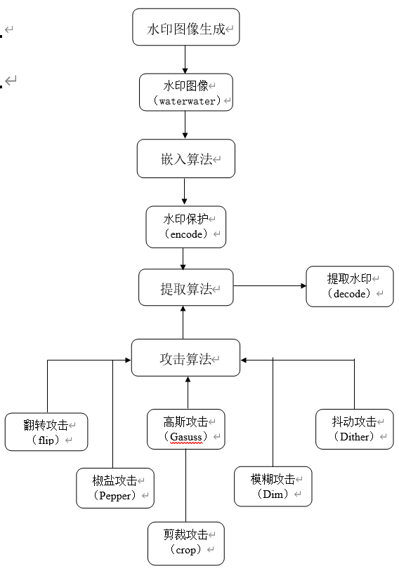 


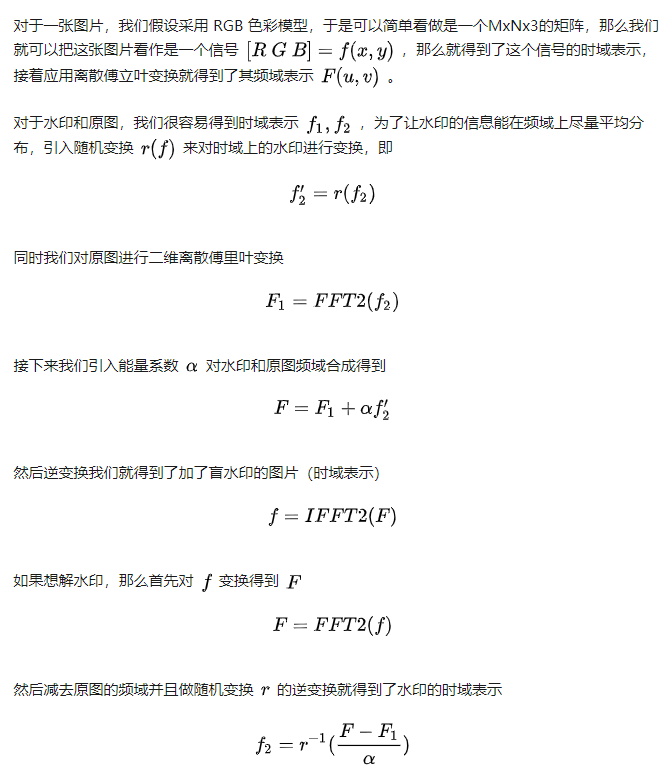


## 四、程序实现


### 1.生成水印图像

```python
from PIL import Image
from PIL import ImageDraw
import hashlib

MD5 = hashlib.md5('水印信息'.encode(encoding='UTF-8')).hexdigest()

image = Image.new('RGB',(850,100),"white")
draw = ImageDraw.Draw(image)
font=ImageFont.truetype("华文新魏.ttf",size=50)
draw.text((20,0), MD5, "black", font=font)
 
image.save(open('waterwater.png','wb'),'png')
```


### 2.嵌入函数

```python
def encode(img_path, wm_path, res_path, alpha):
    img = cv2.imread(img_path)
    img_f = np.fft.fft2(img)
    height, width, channel = np.shape(img)
    watermark = cv2.imread(wm_path)
    wm_height, wm_width = watermark.shape[0], watermark.shape[1]
    x, y = list(range(int(height / 2))), list(range(width))
    random.seed(height + width)
    random.shuffle(x)
    random.shuffle(y)
    tmp = np.zeros(img.shape)
    for i in range(int(height / 2)):
        for j in range(width): 

            if x[i] < wm_height and y[j] < wm_width:
                tmp[i][j] = watermark[x[i]][y[j]]
                tmp[height - 1 - i][width - 1 - j] = tmp[i][j]
    res_f = img_f + alpha * tmp
    res = np.fft.ifft2(res_f)
    res = np.real(res)
    cv2.imwrite(res_path, res, [int(cv2.IMWRITE_JPEG_QUALITY), 100])
```


### 3.提取函数

```python
def decode(ori_path, img_path, res_path, alpha):
    ori = cv2.imread(ori_path)
    img = cv2.imread(img_path)
    ori_f = np.fft.fft2(ori)
    img_f = np.fft.fft2(img)
    height, width = ori.shape[0], ori.shape[1]
    watermark = (ori_f - img_f) / alpha
    watermark = np.real(watermark)
    res = np.zeros(watermark.shape)
    random.seed(height + width)
    x = list(range(int(height / 2)))
    y = list(range(width))
    random.shuffle(x)
    random.shuffle(y)
    for i in range(int(height / 2)):
        for j in range(width):
            res[x[i]][y[j]] = watermark[i][j]
    cv2.imwrite(res_path, res, [int(cv2.IMWRITE_JPEG_QUALITY), 100])
```


### 4.翻转攻击

```python
import cv2 

image = cv2.imread("encode.png")

flipped = cv2.flip(image,1)
cv2.imwrite("Flipped.png", flipped)
```


### 5.椒盐攻击

```python
def sp_noise(image,prob):
    output = np.zeros(image.shape,np.uint8)
    thres = 1 - prob
    
    for i in range(image.shape[0]):
        for j in range(image.shape[1]):
            rdn = random.random()
            if rdn < prob:
                output[i][j] = 0
            elif rdn > thres:
                output[i][j] = 255
            else:
                output[i][j] = image[i][j]
    return output
```


### 6.高斯攻击

```python
def gasuss_noise(image, mean=0, var=0.001):
    image = np.array(image/255, dtype=float)
    noise = np.random.normal(mean, var ** 0.5, image.shape)
    out = image + noise

    if out.min() < 0:
        low_clip = -1.
    else: 

        low_clip = 0.
    out = np.clip(out, low_clip, 1.0)
    out = np.uint8(out*255)

    return out
```


### 7.模糊攻击

```python
def motion_filter(img, K_size=3):
H, W, C = img.shape

    K = np.diag( [1] * K_size ).astype(np.float)
    K /= K_size

pad = K_size // 2

    out = np.zeros((H + pad * 2, W + pad * 2, C), dtype=np.float)
    out[pad: pad + H, pad: pad + W] = img.copy().astype(np.float)
    tmp = out.copy()

    for y in range(H):
        for x in range(W):
            for c in range(C):
                out[pad + y, pad + x, c] = np.sum(K * tmp[y: y + K_size, x: x + K_size, c])
    out = out[pad: pad + H, pad: pad + W].astype(np.uint8)

return out
```


### 8.抖动攻击

```python
def dither(steps): 

    try:
        image = Image.open(root.filename)
    except AttributeError:
        print('No image')
        return
    pixels = image.load()
    for x in range(image.size[0]):
        for y in range(image.size[1]):
            old_pixel = pixels[x, y]
            new_pixel = closest_step(old_pixel, steps)

            pixels[x, y] = new_pixel

            error = tuple([old_pixel[0] - new_pixel[0], old_pixel[1] - new_pixel[1], old_pixel[2] - new_pixel[2]])
            dist_err(image, pixels, x, y, error)
```


### 9.剪裁攻击

```python
def function(image1,image2):
    h1,w1,c1 = image1.shape
    h2,w2,c2 = image2.shape
    
    if c1 != c2:
        print("channels NOT match, cannot merge")
        return 
    else:
        image3 = np.hstack([image2,image1])
        
    return image3
    draw(image, 0)
```


## 五、系统测试


### 1.水印图片

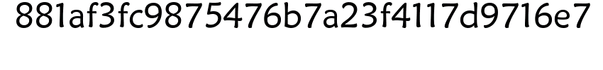

图1-1 学号姓名信息的MD5水印

 

2.嵌入水印图片


图2-1 受保护的图像

 


图2-2 嵌入水印的图像

 

3.水印提取

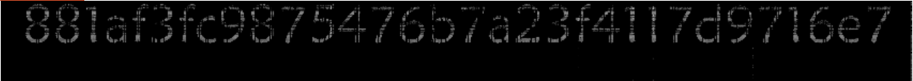

图3-1 提取水印


### 4.翻转攻击后图片及水印提取


图4-1 翻转攻击后的图像

 

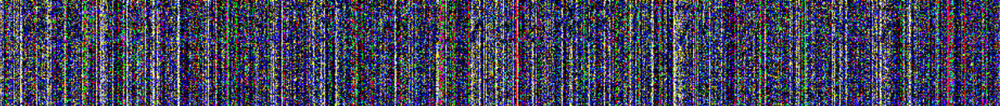

图4-2 翻转攻击后提取水印

 

### 5.椒盐攻击后图片及水印提取


图5-1 椒盐攻击后图片

 

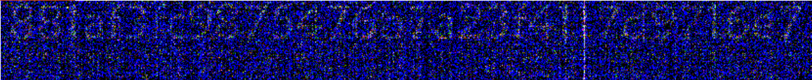

图5-2 椒盐攻击后提取水印


### 6.高斯攻击后图片及水印提取


图6-1 高斯攻击后的图像

 

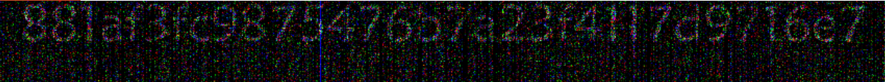

图6-2 高斯攻击后提取水印

 

### 7.模糊攻击后图片及水印提取


图7-1 模糊攻击后的图像

 


图7-2 模糊攻击后提取水印


### 8.抖动攻击后图片及水印提取


图8-1 抖动攻击后的图像

 

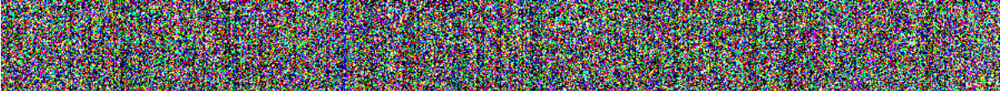

图8-2 抖动攻击后提取水印

 

### 9.剪裁攻击后图片及水印提取


图9-1 剪裁攻击后的图像

 

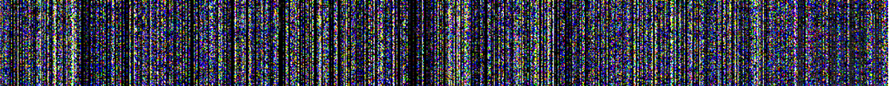

图9-2 剪裁攻击后提取水印

 


## 六、总结及设计体会


### 1.总结分析


从实验结果而言，在三种攻击方式中，自己设计的水印嵌入算法明显在对抗去除攻击方面表现良好，但在对抗几何攻击和破坏攻击上捉襟见肘。


分析原因，在对抗去除攻击时，椒盐攻击和高斯攻击都是向图片加入不同程度的噪声，再利用去噪的方法（如滤波等）去除噪声的同时达到去除水印的目的。但由于盲水印算法是利用离散傅里叶变换将RGB通道下时域表示的图像转换为频域表示，并且通过随机函数让水印信息较“均匀”的分布在原图片内，再通过两者的频域矩阵相加变换为时域后，得到的保护图像；在去除攻击中，因为水印的分布均匀，使得水印的“噪声性”大大降低，从而使去噪成为去除水印的无效手段。


对于几何攻击，图像的位移和剪裁都会大幅度改变图像原有的空间或时间数据，对对水印的提取同步性产生较大影响，这对以图片时域表示为基础的离散傅里叶变换不是利好消息，可以说几何攻击下的水印必然有缺失或受损害；但是，这并不意味着这个水印算法就无效了，相反，当我们把傅里叶变换的能量系数增大时，有如下发现：


图10-1 能量系数alpha为5时，剪裁攻击后的图像


图10-2 能量系数alpha为40时，剪裁攻击后的图像


图10-3 能量系数alpha为5时，剪裁攻击后提取水印


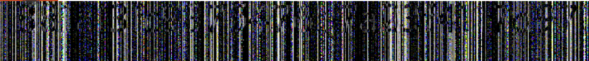

图10-4 能量系数alpha为40时，剪裁攻击后提取水印


可以明显看出，即使水印变换时频域的能量系数提高了8倍，对于生成的保护图像来说，视觉上没有太大影响，而对于提取出的水印，清晰度提高了不少。


对于破环攻击，图像的模糊和抖动都是对图像原有的信息进行损失与错位，在破坏图像的同时破环水印的信息数据，使得提取出的水印出现效果失真等，这是从结果上使水印提取意义失效的攻击方式，但我们同时也发现，同样是对能级系数进行调整后：


图10-5 能量系数alpha为5时，模糊攻击后的图像


图10-6 能量系数alpha为40时，模糊攻击后的图像


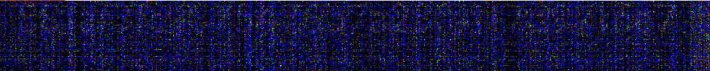

图10-7 能量系数alpha为5时，模糊攻击后提取水印


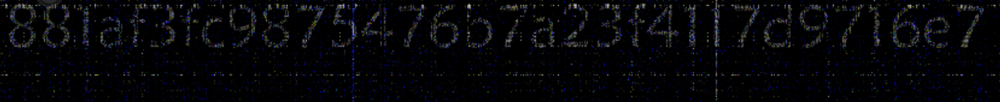

图10-8 能量系数alpha为40时，模糊攻击后提取水印


与几何攻击同样的，在能量系数改变后，原图像视觉上没有发生较大变化，但是提取出的水印却清晰多了，也就意味着以离散傅里叶变换为基础的盲水印算法经受住了这六种不同形式、三种不同方面的攻击。


### 2.设计体会


这次的水印算法设计是思路是先从水印嵌入算法入手的，考虑到实际情况和现有水印嵌入方式的对比，放弃显水印而选择盲水印类型的算法，并且想摆脱以水印信息二进制混沌嵌入图像位数的方式（因为这样很容易识破），就参考了有关盲水印和抗攻击水印算法的一些知识，很自然的关注到了离散傅里叶变换这个点。


通过离散傅里叶变换，一是可以摆脱信息转进制混淆塞入图像的方式，因为离散傅里叶变换恰好融合了图像的RGB三色通道作为时域，与水印图像一同转变为频域矩阵后拟合，在图像进制码上完全找不到痕迹，是很自然使被保护的图像与水印图像融合了；二是使水印图像信息“均匀”的分布在图像内，这里均匀打上了双引号是因为这里的均匀二字，并不是我们常规理解的线性变化，傅里叶变换犹如一个棱镜，将光线穿过折射出的色彩均匀而有层次地划分开来，每一种颜色都有自己所在的频率区段，而这频率区段连续又不可划分，水印图像的信息可以根据原始图像变换出的频谱，各频段不同权重的融入，这就是“均匀”的含义，当然，同时还有random类随机函数的辅助效果。


而这个算法还有便利的地方就是，它与密码学产生了联系，我们实际上有一个密匙k（α，r），因为只有知道了能量级数α、随即变换函数r和原图，才能完成解水印的过程，这相当于完成了简单的对称式加密，也就是说即使攻击者知道图片加了盲水印，由于没有密钥k和原图，也无法去掉盲水印或者替换盲水印。


通过上述的仿密码学设计，我重新回来思考水印信息图像的生成，这个水印图像既要算法自主生成，又要具备一定的安全性，于是我选择先使水印信息具有安全性，然后再生成水印图像，并且选择的方法是对水印信息进行简单的MD5值计算，然后输出MD5值的图像作为水印图像。MD5是极其广用且极其难被反解的方式，即使水印图像被提取，不知道原信息的提取者是极难从一串MD5值反推水印信息的，知道了也没用，只要原作者利用原信息再进行MD5值计算比对就可明显知道图片的归属。


自己设计的算法能达成如此，感慨颇深。

 


## 七、参考文献


[1]. 水印攻击https://wenku.baidu.com/view/7b61603a0912a2161479290c.html


[2]. 齐亚莉, 李业丽. 模糊/去模糊攻击的研究[J]. 北京印刷学院学报, 2005, 13(4):11-13.


[3]. python中numpy.zeros(np.zeros)的使用方法

https://blog.csdn.net/qq_36621927/article/details/79763585


[4]. Max-Min Filter 实现及用于检测图像边缘

https://www.cnblogs.com/wojianxin/p/12502812.html


[5]. 数字水印学习系统之六 攻击模拟

https://blog.csdn.net/iteye_1803/article/details/81767923


[6]. 关于图像抖动实验

https://blog.csdn.net/yuhq3/article/details/78084721


[7]. Numpy知识点补充：np.vstack()&np.hstack()

https://www.jianshu.com/p/2469e0e2a1cf


[8]. Python实现图片裁剪的两种方式——Pillow和OpenCV

https://blog.csdn.net/hfutdog/article/details/82351549


[9]. 图像的傅里叶变换与图像的能量分布——再探

https://blog.csdn.net/denghecsdn/article/details/78906126
